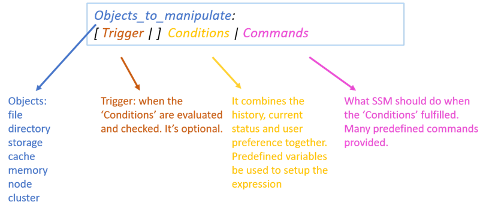

Revision History
==============================================================================================================

|              |           |               |                      |
|--------------|-----------|---------------|----------------------|
| **Revision** | **Date**  | Changes       | Editor               |
| 0.1          | 5/24/2017 | Initial draft | Sammi.chen@intel.com |
|              |           |               |                      |
|              |           |               |                      |
|              |           |               |                      |
|              |           |               |                      |
|              |           |               |                      |

Introduction
==========================================================================================================

This document introduces the definition of APIs exposed by Intel Smart
Storage Management (SSM) to make seamless integration with other Hadoop
components.

There are two sets of APIs, Admin APIs and Application APIs. Admin APIs
are used by Hadoop cluster administrators who are responsible for manage
SSM rules. This set of APIs includes create/delete/list/update SSM
rules. Hadoop super user privilege is required for access Admin APIs.

Application APIs are used by applications run on top of HDFS. This set
of APIs include move/archive/cache file level operation etc. System will
execute the file operation on half of application, with the privilege of
the user who starts the application.

If Application API and Admin API have conflictions, for example, they
want to execute different operation on the same file in the same time,
Application API will precede Admin API. Application API operation will
succeed and Admin API operation on the same file will be cancelled. This
rule is based on the assumption that application knows more about its
data (files) than the cluster administrator.

For easily integration, APIs are exposed as both RPC call and RESTfull
Http interface. Audience can choose the one which fit for their own
environment.

Audience 
---------

This document is written for architects and engineers who are interested
in use Intel Smart Storage Management feature to make full utilization
of high performance storage devices in their Hadoop cluster. Familiarity
with Hadoop HDFS architecture, HDFS erasure coding feature, HDFS
heterogeneous storage feature and HDFS centralized cache feature is
assumed. For basic and/or supplemental information, refer to the
appropriate reference links.

Reference Links
---------------

\[HDFS architecture\]

<https://hadoop.apache.org/docs/r1.2.1/hdfs_design.html>

\[HDFS erasure coding\]

<https://hadoop.apache.org/docs/current/hadoop-project-dist/hadoop-hdfs/HDFSErasureCoding.html>

\[HDFS heterogeneous storage\]

https://hadoop.apache.org/docs/current/hadoop-project-dist/hadoop-hdfs/ArchivalStorage.html

\[HDFS centralized cache\]

https://hadoop.apache.org/docs/stable/hadoop-project-dist/hadoop-hdfs/CentralizedCacheManagement.html

\[Smart storage management\]

https://github.com/Intel-bigdata/SSM

Admin API
=========

Admin API interfaces are used to
manage SSM rules. A rule defines all the things for SSM to work, what
kind of data metrics are involved, what conditions, at what time which
actions should be taken when the conditions are true. By writing rules,
a user can easily manage their cluster and adjust its behavior for
certain purposes.

Define Rule
-----------

User need to define the rule first based on his/her requirements. A rule
has the following format,

A rule contains four parts, Object to manipulate, trigger, conditions
and commands. “:” and “|” are used as the separator to separate
different rule part. These two characters are reserved for SSM, cannot
be used in rule content, otherwise rule parse will fail.

For each rule part, Table 1 lists the currently supported scopes and
examples for reference.

|                      | Scope                                 | Description                                               | Example                                  |
|----------------------|---------------------------------------|-----------------------------------------------------------|------------------------------------------|
| Object to manipulate | File                                  | Files                                                     | *file.path matches "/fooA/\*.dat"*       |
|                      | Storage                               | HDFS storage type                                         | SSD, HDD, Cache                          |
|                      |                                       |                                                           |                                          |
|                      |                                       |                                                           |                                          |
| Trigger              | At &lt;time&gt;                       | Execute the rule at the given time                        | <ul><li>At “2017-07-29 23:00:00”</li><li>At now</li></ul> |
|                      | Every &lt;time interval&gt;           | Execute the rule at the given frequency                   | Every 1min                               |
|                      | From &lt;time&gt; \[To &lt;time&gt;\] | Along with ‘Every’ expression to specify the time scope   | <ul><li>Every 1day from now</li><li>Every 1min from now to now + 7day</li></ul> |                     
|                      |                                       |                                                           |                                          |
| Condition ingredient |File metrics <ul><li>Path</li><li>Age</li><li>Atime</li><li>AccessCount(interval)</li><li>storagePolicy</li><li>length</li><li>isInCache</li><li>Owner</li><li>Group</li></ul> |  <ul><li>Path in HDFS</li><li>Time from last been modified</li><li>Time accessed last time</li><li>Access counts in last interval</li><li>Storage policy of file</li><li>Length of the file</li><li>Test if file is in cache now</li><li>Owner of the file</li><li>File group associated</li></ul> | |
|                      | Storage metrics <ul><li>Utilization(StorageType)</li></ul> | The utilization of the given storage type | Utilization(SSD) &gt; 80%                |
|                      | Time                                  | <ul><li>yyyy-MM-dd HH:mm:ss:ms</li><li>Predefined</li><li>Time + TimeInterval</li></ul> | -   “2017-07-29 23:00:00”    -   Now   -   Now + 7day |
|                      | Time Interval                         | -   Digital + unit    -   Time – Time   | -   5sec, 5min, 5hour, 5day, 5mon, 5year    -   Now - “2016-03-19 23:00:00”           |
|                      | File Size                             | Digital + unit                                            | 5B, 5kb, 5MB, 5GB, 5TB, 5PB              |
|                      | String                                | Start and ends with “, support escapes                    | “abc”, “123”, “Hello world\\n”           |
|                      | Logical operator                      | And, or, not                                              |                                          |
|                      | Digital operator                      | +, -, \*, /, %                                            |                                          |
|                      | Compare                               | &gt;,&gt;=,&lt;,&lt;=,==,!=                               |                                          |
|                      |                                       |                                                           |                                          |
| Command              | CacheFile                             | Cache file in HDFS Cache                                  |                                          |
|                      | UncacheFile                           | Uncache file                                              |                                          |
|                      | ONE\_SSD                              | Move one copy of file to SSD                              |                                          |
|                      | ALL\_SSD                              | Move all copies of file to SSD                            |                                          |
|                      | ALL\_HDD                              | Move file to HDD                                          |                                          |
|                      | ONE\_HDD                              | Move one copy of file to HDD                              |                                          |
|                      | Archive                               | Move file to ‘Archive’ storage type                       |                                          |
|                      | User defined actions                  | Interface defined for user to implement their own actions |                                          |

Here is a rule example,

*file.path matches "/fooA/\*.dat": age gt 30d | archive*

This example defines a rule that for each file with path matches regular
expression “/fooA/\*.dat”, if the file has been created for more than 30
days then move the file to archive storage.

For those who not sure if the rule is defined correctly or not, an API
is provided to check whether the rule is valid or not. Please refer to
the Rule API section for detail API information.

Use Rule
--------

A rule has 4 states in the system, active, disabled, finished and
deleted. Here is the rule state transition diagram.

**Active**:

Once a rule is defined and submitted to SSM, the rule is of “**Active”**
state. When a rule is in this state, SSM will regularly evaluate the
conditions of the rule, create commands when the conditions are met and
execute commands. Once all the commands are executed, the rule will
transit into “**Finished**” state.

**Disabled**:

User can disable an **“Active”** rule if he/she wants to pause the
evaluation of the rule for time being. Later if user want to enable the
rule again, he/she can reactivate the rule, continue the evaluation of
the rule conditions. If there are not executed commands when user
disable a rule, user can choose to cancel these not executed commands or
continue finish these commands. By default, not executed commands will
be cancelled.

**Finished**:

Once all the commands of a rule are executed, the rule enters
“**Finished**” state. A finished rule can be deleted permanently from
the system when it’s in a **“Finished”** state.

**Deleted:**

It’s an ephemeral state of a rule. A rule in this state means the rule
is already been deleted by user, but there are pending commands of this
rule that user still wants to finish. Once all pending commands are
finished, the rule will be permanently deleted from the system.

Rule API
--------

Rule management API are provided in both RPC and RESTful HTTP interface.
Here is the RPC interface definition.

**package** org.apache.hadoop.smart.protocol;

**public interface** RuleProtocol {

*/\*\*  
\* Submit a rule into the system.*

*\* be one of “active”, “disabled” and “dryrun”.  
\* **@param rule** String contains the rule description  
\* **@return** rule ID if rule is submitted successfully  
\* **@throws** IOException If submit rule failed. The Exception should
contains  
\* detail message about failure reason.  
\*/  
***long** submitRule(String rule) **throws** IOException;  
  
*/\*\*  
\* Submit a rule into the system with specified initial state. The
initial state must*

*\* be one of “active”, “disabled” and “dryrun”.  
\* **@param rule** String contains the rule description  
\* **@param initState** Specify the rule state if rule is submitted  
\* successfully. It's an optional parameter. If not  
\* specified, by default rule will be of active state.  
\* **@return** rule ID if rule is submitted successfully  
\* **@throws** IOException If submit rule failed. The Exception should
contains  
\* detail message about failure reason.  
\*/  
***long** submitRule(String rule, RuleState initState) **throws**
IOException;  
  
*/\*\*  
\* Verify if it is a valid rule.  
\* **@param rule** String contains the rule description  
\* **@throws** IOException throw the exception if rule is invalid. The  
\* Exception should contains detail message about where the rule is
invalid.  
\*/  
***void** checkRule(String rule) **throws** IOException;  
  
*/\*\*  
\* Get information about the rule with ruleID.  
\* **@param ruleID  
**\* **@return** RuleInfo, contains detail rule information  
\* **@throws** IOException throw exception when rule with ID is not
found  
\*/  
*RuleInfo getRule(**long** ruleID) **throws** IOException;  
  
*/\*\*  
\* List all current rules in the system, including active, disabled,
finished and deleted.  
\* **TODO: improve the API to return rules of certain state.  
**\* **@return** A list contains all current rules in the system  
\* **@throws** IOException  
\*/  
*List&lt;RuleInfo&gt; listRules() **throws** IOException;  
  
*/\*\*  
\* Delete a rule from SSM. If dropPendingCommands is false then the
rule  
\* will still be kept in the system with “deleted” state. Once all the
pending commands*

*\* are finished then the rule will be deleted ultimately. Only
“disabled” or “finished” rule*

*\* can be deleted.  
\*  
\* **@param ruleID** ID of the rule to be deleted  
\* **@param dropPendingCommands** whether to drop pending commands
triggered by the rule or not.  
\* **@throws** IOException  
\*/  
***void** deleteRule(**long** ruleID, **boolean** dropPendingCommands)
**throws** IOException;

*/\*\*  
\* Enable a rule. Only “disabled” rule can be enabled. Enable other
state rule will throw exception.*

*\*  
\* **@param ruleID** ID of the rule to be enabled  
\* **@throws** IOException  
\*/*  
**void** enableRule(**long** ruleID) **throws** IOException;

*/\*\*  
\* Disable a rule. If dropPendingCommands is false then the rule  
\* will still be marked as “disabled” state while all the pending
commands continue to execute to finish. *

*\* Only “active” rule can be disabled.  
\*  
\* **@param ruleID** ID of the rule to be disabled  
\* **@param dropPendingCommands** whether to drop pending commands
triggered by the rule or not.  
\* **@throws** IOException  
\*/*  
void disableRule(long ruleID, boolean dropPendingCommands) throws
IOException;

}

Application API
===============

Application APIs are used by applications run on top of HDFS. This set
of APIs include move/archive/cache file level operation etc. System will
execute the file operation on half of application, with the privilege of
the user who starts the application. SSM will provide a SSMClient which
includes both HDFS DFSClient functions and new SSM Application APIs.
Upper level application can use this SSMClient instead of original HDFS
DFSClient. Here is the diagram.

Command API
-----------

**package** org.apache.hadoop.smart.protocol;

**public interface** SSMClientProtocol {

*/\*\*  
\* List all command name currently supported by the system.*

*\* Current supported command name are “move”, “cache”, “uncache” etc.*

*\* **@return** string array that contains supported command names*

*\* **@throws** IOException if the operation failed.*

*\*/  
***String\[\]** getCommandList() **throws** IOException;

*/\*\*  
\* A synchronized generic API to execute command. *

*\* System will maintain an internal task to performance the action. The
API will return until the task is finished.  
\* **@param filePath** the path of file  
\* @param cmdParams the parameters passed to command before execution  
\* **@throws** IOException If submit operation failed. The Exception
should contains  
\* detail message about failure reason.  
\*/  
***void** executeCommand(String cmdName, String\[\] cmdParams)
**throws** IOException;

*/\*\*  
\* A asynchronized generic API to execute command. *

*\* System will maintain an internal task to performance the action. The
API will return immediately*

*\* once the internal task is created.  
\* **@param filePath** the path of file  
\* @param **cmdParams** the parameters passed to command before
execution*

*\* @return command ID if operation is submitted successfully  
\* **@throws** IOException If submit operation failed. The Exception
should contains  
\* detail message about failure reason.  
\*/  
***long** executeCommandAsync(String cmdName, String\[\] cmdParams)
**throws** IOException;

*/\*\*  
\* Get the command’s information. The most important information is the
state of the command. *

*\* *

*\*  
\* **@param cmdID** ID of command to query  
\*  
\* **@throws** IOException If submit operation failed. The Exception
should contains  
\* detail message about failure reason.  
\*/  
*CommandInfo getCommand(long cmdID) **throws** IOException;

*/\*\*  
\* Try to delete a submitted command. If the command is running, delete
will fail. *

*\* The API will return when the command is deleted or the try failed. *

*\*  
\* **@param cmdID** ID of command to delete  
\*  
\* **@throws** IOException If submit operation failed. The Exception
should contains  
\* detail message about failure reason.  
\*/  
***void** deleteCommand(long cmdID) **throws** IOException;

}
