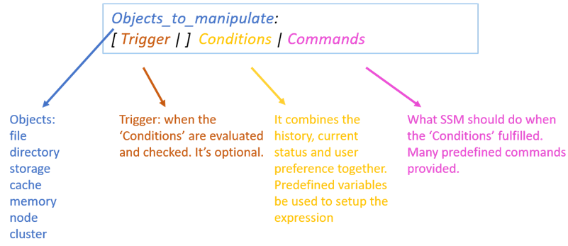
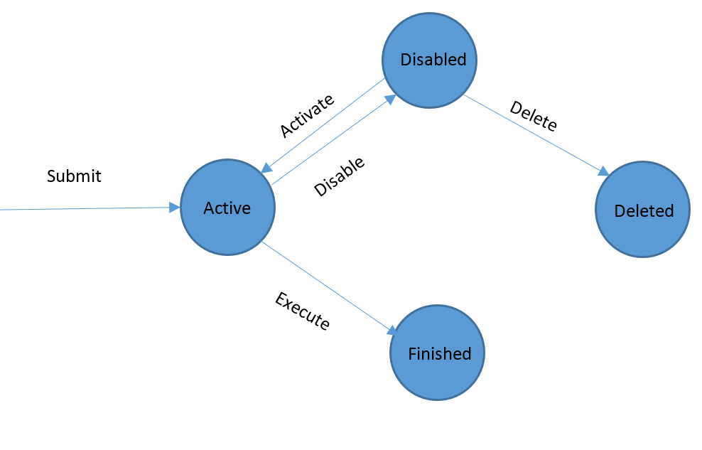

Introduction
==========================================================================================================

This document introduces the definition of APIs exposed by Intel Smart
Storage Management (SSM) to make seamless integration with other Hadoop
components.

There are two sets of APIs, Admin APIs and Application APIs. Admin APIs
are used by Hadoop cluster administrators who are responsible for manage
SSM rules. This set of APIs includes create/delete/list/update SSM
rules. Hadoop super user privilege is required for access Admin APIs.

Application APIs are used by applications run on top of HDFS. This set
of APIs include move/archive/cache file level operation etc. System will
execute the file operation on half of application, with the privilege of
the user who starts the application.

If Application API and Admin API have conflictions, for example, they
want to execute different operation on the same file in the same time,
Application API will precede Admin API. Application API operation will
succeed and Admin API operation on the same file will be cancelled. This
rule is based on the assumption that application knows more about its
data (files) than the cluster administrator.

For easily integration, APIs are exposed as both RPC call and RESTfull
Http interface. Audience can choose the one which fit for their own
environment.

Audience 
---------

This document is written for architects and engineers who are interested
in use Intel Smart Storage Management feature to make full utilization
of high performance storage devices in their Hadoop cluster. Familiarity
with Hadoop HDFS architecture, HDFS erasure coding feature, HDFS
heterogeneous storage feature and HDFS centralized cache feature is
assumed. For basic and/or supplemental information, refer to the
appropriate reference links.

Define Rule
-----------

A rule defines all the
things for SSM to work, what kind of data metrics are involved, what
conditions, at what time which actions should be taken when the
conditions are true. By writing rules, a user can easily manage their
cluster and adjust its behavior for certain purposes.

User need to define the rule first based on his/her requirements. A rule
has the following format,

A rule contains four parts, Object to manipulate, trigger, conditions
and commands. “:” and “|” are used as the separator to separate
different rule part. These two characters are reserved for SSM, cannot
be used in rule content, otherwise rule parse will fail.

Detail information of each rule part are listed in following tables.

Table - 1 Objects to manipulate

| Object  | Description       | Example                            |
|---------|-------------------|------------------------------------|
| File    | Files             | *file.path matches "/fooA/\*.dat"* |
| Storage | HDFS storage type | SSD, HDD, Cache                    |
|         |                   |                                    |

Table - 2 Triggers

| Format                                | Description                                             | Example                               |
|---------------------------------------|---------------------------------------------------------|---------------------------------------|
| At &lt;time&gt;                       | Execute the rule at the given time                      | -   At “2017-07-29 23:00:00”   -   At now |
| Every &lt;time interval&gt;           | Execute the rule at the given frequency                 | Every 1min                            |
| From &lt;time&gt; \[To &lt;time&gt;\] | Along with ‘Every’ expression to specify the time scope | -   Every 1day from now    -   Every 1min from now to now + 7day  |
|                                       |                                                         |                                       |

Table – 3 Conditions

| Ingredient       | Description                                                                              | Example                                  |
|------------------|------------------------------------------------------------------------------------------|------------------------------------------|
| Object property  | Object property as condition subject, refer to table-4 to supported object property list | Length &gt; 5MB                          |
| Time             | -   “yyyy-MM-dd HH:mm:ss:ms”    -   Predefined    -   Time + TimeInterval | -   “2017-07-29 23:00:00”    -   Now     -   Now + 7day  |
| Time Interval    | -   Digital + unit   -   Time – Time  | -   5sec, 5min, 5hour, 5day, 5mon, 5year    -   Now - “2016-03-19 23:00:00”           |
| File Size        | Digital + unit                                                                           | 5B, 5kb, 5MB, 5GB, 5TB, 5PB              |
| String           | Start and ends with “, support escapes                                                   | “abc”, “123”, “Hello world\\n”           |
| Logical operator | And, or, not                                                                             |                                          |
| Digital operator | +, -, \*, /, %                                                                           |                                          |
| Compare          | &gt;,&gt;=,&lt;,&lt;=,==,!=                                                              |                                          |

Table – 4 Object properties

| Object   | Property                 | Description                                    |
|----------|--------------------------|------------------------------------------------|
| File     | path                     | Path in HDFS                                   |
|          | age                      | Time from last been modified                   |
|          | atime                    | Time accessed last time                        |
|          | accessCount(interval)    | Access counts during in the last time interval |
|          | storagePolicy            | Storage policy of file                         |
|          | length                   | Length of the file                             |
|          | isInCache                | Test if file is in cache now                   |
|          | Owner                    | Owner of the file                              |
|          | Group                    | File group associated                          |
| Storage  | Utilization(StorageType) | The utilization of the given storage type      |

Table – 5 Commands

| Command(case insensitive) | Description                                               |
|---------------------------|-----------------------------------------------------------|
| cache\_file               | Cache file in HDFS Cache                                  |
| Uncache\_file             | Uncache file                                              |
| one\_ssd                  | Move one copy of file to SSD                              |
| all\_ssd                  | Move all copies of file to SSD                            |
| all\_hdd                  | Move file to HDD                                          |
| one\_hdd                  | Move one copy of file to HDD                              |
| archive                   | Move file to ‘Archive’ storage type                       |
| user defined actions      | Interface defined for user to implement their own actions |

Here is a rule example,

*file.path matches "/fooA/\*.dat": age &gt; 30d | archive*

This example defines a rule that for each file with path matches regular
expression “/fooA/\*.dat”, if the file has been created for more than 30
days then move the file to archive storage.

For those who not sure if the rule is defined correctly or not, an API
is provided to check whether the rule is valid or not. Please refer to
the Rule API section for detail API information.

Use Rule
--------

A rule has 4 states in the system, active, disabled, finished and
deleted. Here is the rule state transition diagram.

**Active**:

Once a rule is defined and submitted to SSM, the rule is of “**Active”**
state. When a rule is in this state, SSM will regularly evaluate the
conditions of the rule, create commands when the conditions are met and
execute commands. Once all the commands are executed, the rule will
transit into “**Finished**” state.

**Disabled**:

User can disable an **“Active”** rule if he/she wants to pause the
evaluation of the rule for time being. Later if user want to enable the
rule again, he/she can reactivate the rule, continue the evaluation of
the rule conditions. If there are not executed commands when user
disable a rule, user can choose to cancel these not executed commands or
continue finish these commands. By default, not executed commands will
be cancelled.

**Finished**:

Once all the commands of a rule are executed, the rule enters
“**Finished**” state. A finished rule can be deleted permanently from
the system when it’s in a **“Finished”** state.

**Deleted:**

It’s an ephemeral state of a rule. A rule in this state means the rule
is already been deleted by user, but there are pending commands of this
rule that user still wants to finish. Once all pending commands are
finished, the rule will be permanently deleted from the system.

Rule Management API
-------------------

Rule management API are provided in both RPC and RESTful HTTP interface.
Here is the RPC interface definition. RESTFull HTTP interface will be
updated later.

 
/* Submit a rule into the system. */  
long **submitRule**(**String** rule) **throws** IOException;  
  
 
/* Submit a rule into the system with specified initial state. The initial state can be “active” or “disabled”. If initial state is not specified, then by default rule will be of “active” state. */  
long **submitRule**(**String** rule, **RuleState** initState) **throws** IOException;  
  
/\*\*  
\* Verify if it is a valid rule.  
\*/  
void **validateRule**(**String** rule) **throws** IOException;  
  
/\*\*  
\* Get information about the rule with ruleID.  
\*/  
RuleInfo **getRule**(**long** ruleID) **throws** IOException;  
  
/\*\*  
\* List all current rules in the system, including active, disabled, finished and deleted.  
\*/  
List&lt;RuleInfo&gt; **listRules**() **throws** IOException;  
  
/\*\*  
\* Delete a rule from SSM. If dropPendingCommands is false then the rule  
\* will still be kept in the system with “deleted” state. Once all the pending commands
\* are finished then the rule will be deleted ultimately. Only “disabled” or “finished” rule
\* can be deleted.  
\*/  
void **deleteRule**(**long** ruleID, **boolean** dropPendingCommands)
**throws** IOException;

/* Enable a rule. Only “disabled” rule can be enabled. Enable other state rule will throw exception. */  
void **enableRule**(**long** ruleID) **throws** IOException;

/\*\*  
\* Disable a rule. If dropPendingCommands is false then the rule  
\* will still be marked as “disabled” state while all the pending commands continue to execute to finish.
\* Only “active” rule can be disabled.  
\*/
void **disableRule**(**long** ruleID, **boolean** dropPendingCommands) **throws**
IOException;
