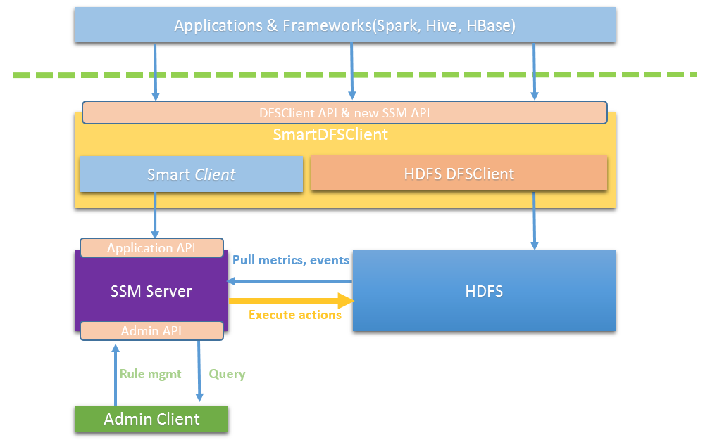
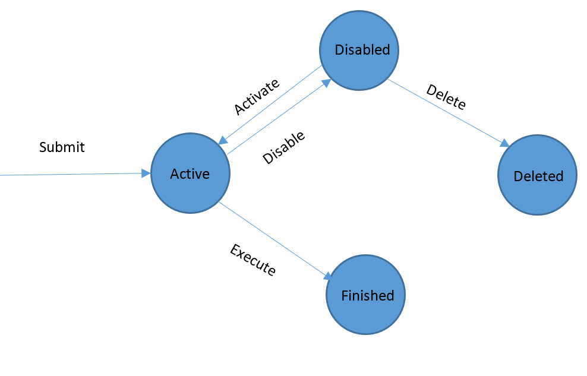

Admin API
==========================================================================================================

This document introduces the definition of APIs exposed by Intel Smart
Storage Management (SSM) to make seamless integration with other Hadoop
components.

There are two sets of APIs, Admin APIs and Application APIs. Admin APIs
are used by Hadoop cluster administrators who are responsible for managing
SSM rules. This set of APIs is used to create/delete/list/update SSM
rules. Hadoop super user privilege is required to access Admin APIs.

Application APIs are used by applications running on top of HDFS. This set
of APIs is used to move/archive/cache file. The system will
execute the file operations on behalf of the application, with the privilege of
the user who started the application.

If Application API and Admin API are in conflict, for example, in the case of that they
are executing different operations on the same file at the same time,
Application API will precede Admin API. Application API operation will
succeed and Admin API operation on the same file will be cancelled. This
rule is based on the assumption that application knows more about its
data (files) than the cluster administrator.

For easy integration, the APIs are exposed via both RPC and RESTful interfaces. Users can choose the one which fits their environment.

Define Rule
-----------

A rule defines all the
things for SSM to work, including what kind of data metrics that are involved, what
conditions, and at what time the given actions should start to execute when
conditions are met. By defining rules, a user can easily manage their
cluster and adjust its behavior for certain purposes.

Users need to define the rule first based on the requirements. A rule
has the following format,

A rule contains four parts: Object, Trigger (Check Time), conditions
and commands (Actions). “:” and “|” are used as the separator to separate
different rule parts, as the above picture shows.

Detailed information for each rule part is listed in the following tables.

Table-1 Objects

| Object  | Description          | Example                             |
|---------|----------------------|-------------------------------------|
| file    | files to be managed  | *file: path matches "/fooA/\*.dat"* |

Table-2 Trigger (Check Time)

| Format                                | Description                                                                                 | Example                               |
|---------------------------------------|---------------------------------------------------------------------------------------------|---------------------------------------|
| at &lt;Time&gt;                       | Check the rule condition at the given time. See the below "Time" table.                     | * at “2017-07-29 23:00:00”  * at now   |
| every &lt;Time Interval&gt;           | Check the rule condition at the given time interval. See the below "Time" table.            | * every 1min                            |
| from &lt;Time&gt; \[To &lt;Time&gt;\] | Along with ‘every’ expression to specify the time scope.                                    | * every 1day from now  * every 1min from now to now + 7day  |

Table-3 Time

| Ingredient       | Description                                                                                        | Example                                               |
|------------------|----------------------------------------------------------------------------------------------------|-------------------------------------------------------|
| Time             | “yyyy-MM-dd HH:mm:ss:ms”    -   Predefined    -   Time + Time Interval                       | * “2017-07-29 23:00:00”  * now   * now + 7day         |
| Time Interval    | Digital + unit  Time – Time  Time Interval + Time Interval                                   | * 5ms, 5sec, 5min, 5hour, 5day  * now - “2016-03-19 23:00:00”  * 5hour + 5min           |

Table-4 Condition Ingredient

| Ingredient       | Description                                                                                        | Example                                  |
|------------------|----------------------------------------------------------------------------------------------------|------------------------------------------|
| Object property  | Object property as condition subject, refer to table-5.                                            | length &gt; 5MB                          |
| Logical operator | and, or, not                                                                                       |                                          |
| Digital operator | +, -, \*, /, %                                                                                     |                                          |
| Compare          | &gt;, &gt;=, &lt;, &lt;=, ==, !=                                                                   |                                          |

Table-5 Object Properties

| Object   | Property                         | Description                                                                                 |
|----------|----------------------------------|---------------------------------------------------------------------------------------------|
|          | age                              | The time span from last modification moment to now                                          |
|          | atime                            | The last access time                                                                        |
|          | blocksize                        | The block size of the file                                                                  |
|          | inCache                          | The file is in cache storage                                                                |
|          | isDir                            | The file is a directory                                                                     |
|          | length                           | Length of the file. Currently, only pure digital is supported, which indicates bytes number.|
|   file   | path                             | The file path in HDFS                                                                       |
|          | mtime                            | The last modification time of the file                                                      |
|          | unsynced                         | The file is not synced                                                                      |
|          | storagePolicy                    | Storage policy of file                                                                      |
|          | accessCount(Time Interval)       | The access counts during the last time interval                                             |
|          | accessCountTop(interval,N )      | The topmost N for access counts during the last time interval                               |
|          | accessCountBottom(interval,N)    | The bottommost N for access counts during the last time interval                            |
|          | accessCountTopOnStoragePolicy(interval,N,$StoragePolicy")    | The topmost N for access counts with regard to a storage policy.The supported HDFS storage policies are COLD,WARM,HOT,ONE_SSD,ALL_SSD,LAZY_PERSIST |
|          | accessCountBottomOnStoragePolicy(interval,N,$StoragePolicy") | The bottommost N for access counts with regard to a storage policy during the last time interval |

Table-6 Commands

| Command (case sensitive)  |  Description                                                                                                      |
|---------------------------|-------------------------------------------------------------------------------------------------------------------|
|  allssd                   |  Move $file to SSD storage                                                                                        |
|  alldisk                  |  Move $file to disk storage                                                                                       |
|  append                   |  Append $file with $length length and $bufSize buffer size                                                        |
|  archive                  |  Archive $file                                                                                                    |
|  cache                    |  Cache $file to HDFS cache                                                                                        |
|  checkstorage             |  Show the storage type of $file                                                                                   |
|  compact                  |  Compact $file1, $file2, etc. to $containerFile                                                                   |
|  concat                   |  Concatenate the files in $src which lists at least two files separated by comma and $dest is the target file     |
|  copy                     |  Copy the file in $src with $offset offset, $length length and $size buffer size                                  |
|  copy2s3                  |  Copy $file to $s3_dest which is on Amazon S3,$s3_dest is a url starts with s3a://                                |                                             |
|  delete                   |  Delete $file                                                                                                     |
|  echo                     |  Echo -msg $message                                                                                               |
|  list                     |  List all the files in $src                                                                                       |
|  merge                    |  Merge the files in $src which lists at least two files separated by comma and $dest is the target file           |                                                                       |
|  onedisk                  |  Move one replica of $file to disk                                                                                |
|  onessd                   |  Move one replica of $file to SSD                                                                                 |
|  ramdisk                  |  Move $file to RAM_DISK                                                                                           |
|  read                     |  Read $file with $size buffer size                                                                                |
|  rename                   |  Rename $src to $dest                                                                                             |
|  truncate                 |  Truncate $src to $length size                                                                                    |
|  truncate0                |  Truncate $src to 0 size                                                                                          |
|  uncache                  |  Uncache $file from HDFS cache                                                                                    |
|  uncompact                |  Uncompact $containerFile to original files                                                                       |
|  write                    |  Write random data to $file with $size buffer size and $length length                                             |
|  sleep                    |  Sleep for given time                                                                                             |
|  sync                     |  Sync file to remote cluster                                                                                      |
|  user defined actions     |  Interface defined for user to implement their own actions                                                        |

Rule Example
------------

*`file with path matches "/fooA/\*.dat": age &gt; 30day | archive`*

This example defines a rule that for each file (specified before key word 'with') whose path matches regular
expression “/fooA/\*.dat”, if the file has been created for more than 30
days then move the file to archive storage. The rule can be rewritten in the following way:

*`file : path matches "/fooA/\*.dat" and age &gt; 30day | archive`*

The boolean expression can also be placed in condition expression.

*`file: at now+30s | path matches "/src1/*" | sync -dest /dest1`*

*`file: at "2020-06-23 14:30:00" | path matches "/src2/*" | sync -dest /dest2`*

*`file: every 5s | path matches "/src3/*" and length>9999 | sync -dest /dest3`*

For those who are not sure if the rule is defined correctly or not, an API
is provided to check whether the rule is valid or not. Please refer to
the Rule API section for detailed API information.

Use Rule
--------

A rule has 4 states in the system: active, disabled, finished, and
deleted. Here is the rule state transition diagram.

**Active**:

Once a rule is defined and submitted to SSM, the rule is in “**Active”**
state. When a rule is in this state, SSM will regularly evaluate the
conditions of the rule, create commands when the conditions are met and
execute the commands. Once a rule finishes (rules that are only  checked at a
given time or within a time interval), the rule will transit to “**Finished**” state.

**Disabled**:

User can disable an **“Active”** rule if he/she wants to pause the
evaluation of the rule for the time being. Later if the user wants to enable the
rule again, he/she can re-activate the rule, to continue the evaluation of
the rule conditions. If there are as yet unexecuted actions associated with a disabled rule,
user can choose to cancel these unexecuted actions or continue to process/finish them.
By default, the  unexecuted actions will be cancelled.

**Finished**:

If a rule is a one-shot rule or a time-constrained rule whose time condition has been satisfied,
the rule will enter the “**Finished**” state. A finished rule can
be deleted permanently from the system.

**Deleted:**

It’s an ephemeral state of a rule. A rule in this state means the rule
has already been deleted by user, but there are pending actions of this
rule that user wants to complete. Once all pending actions are
finished, the rule will be permanently deleted from the system.

Rule Management API
-------------------

Rule management API is provided for both the RPC and RESTful HTTP interfaces.
Here is the RPC interface definition. RESTful HTTP interface will be
updated later.

 
* long **submitRule**(**String** rule) **throws** IOException;  

  Submit a rule  

* long **submitRule**(**String** rule, **RuleState** initState) **throws** IOException;

  Submit a rule with specified initial state. The initial state can be “active” or “disabled”. If initial state is not specified, then by default rule will be of “active” state.

* void **checkRule**(**String** rule) **throws** IOException;

  Verify rule

* RuleInfo **getRule**(**long** ruleID) **throws** IOException;  

  Get rule information

* List&lt;RuleInfo&gt; **listRules**() **throws** IOException;  

  List all current rules in the system, including active, disabled, finished, or deleted.

* void **deleteRule**(**long** ruleID, **boolean** dropPendingCmdlets) **throws** IOException;

  Delete a rule. If dropPendingCmdlets is false then the rule will still be kept in the system with “deleted” state. Once all the pending commands are finished then the rule will be deleted. Only “disabled” or “finished” rule can be deleted.

* void **enableRule**(**long** ruleID) **throws** IOException;
 
  Enable a rule. Only “disabled” rules can be enabled. Enabling a rule in other states will throw exception.

* void **disableRule**(**long** ruleID, **boolean** dropPendingCmdlets) **throws** IOException;
 
  Disable a rule. If dropPendingCmdlets is false, the rule will be marked as “disabled” state immediately, but all the pending actions will still be executed. Only an “active” rule can be disabled.
