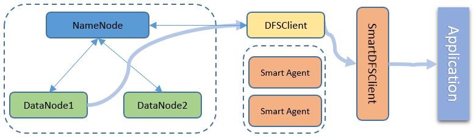
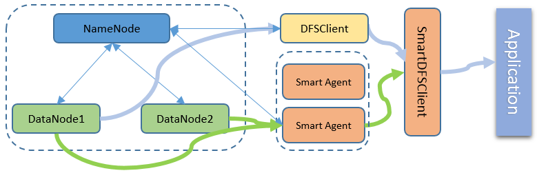

Continuous Block Layout Erasure Coding (EC) 
============================================

The default HDFS 3x replication scheme is expensive. It incurs a 200%
storage space overhead and other resources, such as network bandwidth
when writing the data. In Hadoop3.0, HDFS erasure coding feature is
introduced to address this challenge. After a study of the HDFS
file-size distribution, the first phase of HDFS Erasure Coding is to
support erasure coding with striped layout. In this design document, we
propose the contiguous block layout erasure coding within SSM framework.
The [HDFS RAID](https://wiki.apache.org/hadoop/HDFS-RAID) solution is an
excellent pioneer in continuous block erasure coding. We have learned a
lot from its design and experience.

Striped EC vs Block EC
======================

### Striped EC pros and cons

-   Favor small size file

-   No data locality

-   Suitable for cold data

EC with striped layout can achieve storage saving with both small files
and large files, especially the small files. While one drawback is it
loses the data locality which may impact the performance of upper layer
application when running on striped EC files. So basically, striped EC
file is more suitable for cold data. For more Striped EC introduction,
refer to this [Cloudera Blog](https://blog.cloudera.com/blog/2015/09/introduction-to-hdfs-erasure-coding-in-apache-hadoop/).

### Block EC pros and cons

-   Favor large size file

-   Keep data locality

-   Suitable for hot and warm data

Block EC is suitable for very large files because there is space saving
only when full block stripe is written. Also block EC is an offline or
background EC. So a client has no need to buffer GBs of data blocks on
memory to calculate parity. Compared with striped EC, block EC keeps the
data locality, it can be used to persist hot and warm data.

Design Targets 
===============

The following lists the targets of this design:

1. Provide DFSClient compatible data read/write API

2. On-fly data recovery during read operation if data is corrupted

2. Transparent data recovery in background

Supported Erasure Coding Policies

This implementation will leverage existing Hadoop 3.0 erasure coding
Codecs. All Hadoop 3.0 supported EC policies will be supported on block
layout EC. Please refer to [Hadoop 3.0 EC guide](https://hadoop.apache.org/docs/current/hadoop-project-dist/hadoop-hdfs/HDFSErasureCoding.html)
for detail EC policy information.

Use Cases
=========

Write File
----------

In SSM infrastructure, all user prefers are represented by rules. For
block EC files, apply the block EC rule to the files. SmartDFSClient
will replace the existing HDFS Client, be responsible to write data to
HDFS. In the write path, SmartDFSClient will write data into HDFS first
as traditional 3x files, then in the background, SSM server will
regularly scan involved files, initiating tasks to compute parity blocks
for each file, create a parity file for each file by concatenating
parity blocks of this file together.

Convert 3x Replica file to Block EC file
----------------------------------------

For some existing 3x replication large files, user many want to convert them to block EC files to save storage space. Apply block EC rule to the files or the directories will trigger the conversion in background. 

Read Block EC file 
-------------------

SmartDFSClient will leverage DFSClient to read file content. If there is no data
corrupted, SmartDFSClient will just read data and return the data back
to applications directly.

Read Corrupted Block EC file
----------------------------

If there is error returned because of data corruption during the read
process, SmartDFSClient will then allocate additional threads to read
remaining data blocks and parity blocks, run the decode calculation to
recover the lost data, and return the recovered content to application.
The decoded content will been thrown away after used.

Background Reconstruct Corrupted Block EC File
----------------------------

SSM server will also schedule regular tasks to check the integrity of each data file and
parity file. Once content corruption is detected, SSM server will send
tasks to Smart Agent to recover the content in background.

Compact Small Files under Directory to Block EC File
----------------------------

When files under directory are all small files, there is no space saving
when block EC is applied to each file independently. In this case, we
can put Block EC to the whole directory. Files with same owner will be
grouped together, only one parity file will be generated for all data
blocks in the same group. With this approach, we can save more space
than file level EC.

Performance Consideration
=========

In all above five use cases, write file and read file operation have the
same performance as DFSClient. Convert 3x replication file to block EC
file and background reconstruction corrupted file are all transparent to
application. Only the read corrupted file operation will have
performance degradation compared to read 3x replica file. Consider the
massive storage space saving, this trade-off is kind of worthy.

Architecture
============

Block EC file is transparent to HDFS. After user apply the block EC rule
to HDFS files and directories, for each involved HDFS file, there will
be a parity file. SSM server will maintain the relationship between the
HDFS data file and parity file into meta data store. For file level
continuous block layout EC, following information should be recorded for
each data file,

-   Data file path

-   EC policy name

-   Parity file path

-   State(data-under-construction, healthy, corrupted,
    parity-under-construction, under-recovery, damaged)

For directory level continuous block layout EC case, for each block
group, there should be an array of (data block + parity block) items,
each item includes,

-   Data file path

-   Block ID

-   Index into block group

For the while directory level block EC file, following general information should also be recorded,

-   parity file path

-   block size

-   EC policy name

-   State(data-under-construction, healthy, corrupted,
    parity-under-construction, under-recovery, damaged)

