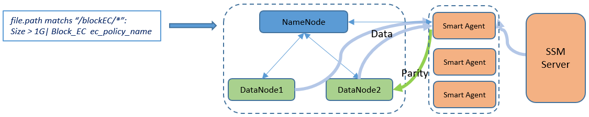
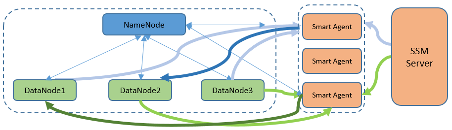
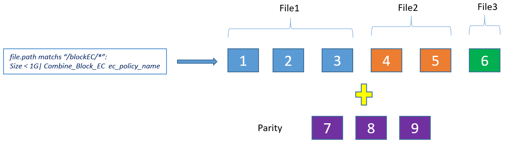
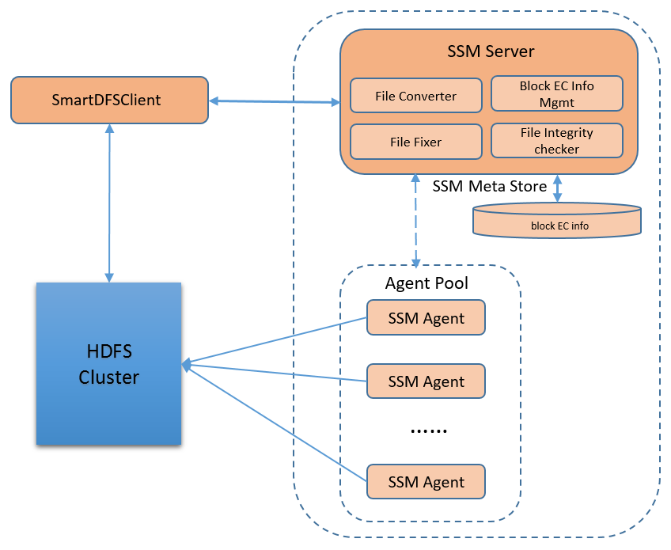

Continuous Block Layout Erasure Coding (EC) 
============================================

The default HDFS 3x replication scheme is expensive. It incurs a 200%
storage space overhead and other resources, such as network bandwidth
when writing the data. In Hadoop3.0, HDFS erasure coding feature is
introduced to address this challenge. After a study of the HDFS
file-size distribution, the first phase of HDFS Erasure Coding is to
support erasure coding with striped layout. In this design document, we
propose the contiguous block layout erasure coding within SSM framework.
The [HDFS RAID](https://wiki.apache.org/hadoop/HDFS-RAID) solution is an
excellent pioneer in continuous block erasure coding. We have learned a
lot from its design and experience.

Striped EC vs Block EC
======================
EC with striped layout can achieve storage saving with both small files and large files. It supports online erasure coding and when data writen to HDFS, the coding is already done. On high speed network environment, it outperforms than replica because at the same time it can write to more than one datanode in parallevel. While one drawback is it loses the data locality advantage which may impact the performance of upper layer applications especially for those particularly optimized according to the advantage. For more Striped EC introduction,
refer to this [our joint blog with Cloudera](https://blog.cloudera.com/blog/2015/09/introduction-to-hdfs-erasure-coding-in-apache-hadoop/).

Block EC is very suitable for very large files of enough blocks needed by a erasure coding group. The erasure coding is done offline and in background instead of online while client writing data. Compared with striped EC, block EC keeps data locality, being of less performance impact to some frameworks and applications.

Design Targets 
===============

The following lists the targets of this design:

1. Provide DFSClient compatible data read/write API

2. On-fly data recovery during read operation if data is corrupted

2. Transparent data recovery in background

Supported Erasure Coding Codecs
======================
This implementation will leverage existing Hadoop 3.0 erasure coding Codecs. All Hadoop 3.0 supported EC codecs will be ported and supported on block layout EC.

Use Cases
=========

Write file
----------

In the write path, there needn't change. HDFS client still writes data into HDFS as traditional 3x files, then in the background, SSM server will regularly scan involved files, initiating tasks to compute parity blocks for each file, create a parity file for each file by concatenating parity blocks of this file together.

Case 1. Convert 3x replica file to block EC file
----------------------------------------

For some existing 3x replication large files, user many want to convert them to block EC files to save storage space. Apply block EC rule to the files or the directories will trigger the conversion in background. 

Case 2. Read block EC file 
-------------------

SmartDFSClient will leverage DFSClient to read file content. If there is no data corrupted, SmartDFSClient will just read data and return the data back to applications directly.

Case 3. Read corrupted block EC file
----------------------------

If there is error returned because of data corruption during the read
process, SmartDFSClient will then allocate additional threads to read
remaining data blocks and parity blocks, run the decode calculation to
recover the lost data, and return the recovered content to application.
The decoded content will been thrown away after used.

Case 4. Background reconstruct corrupted block EC File
----------------------------

SSM server will also schedule regular tasks to check the integrity of each data file and parity file. Once content corruption is detected, SSM server will send tasks to Smart Agent to recover the content in background.

Case 5. Compact Small Files under Directory to Block EC File
----------------------------

When files under directory are all small files, there is no space saving when block EC is applied to each file independently. In this case, we can put Block EC to the whole directory. Files with same owner will be grouped together, only one parity file will be generated for all data blocks in the same group. With this approach, we can save more space than file level EC.

Performance Consideration
=========

In all above five use cases, write file and read file operation have the same performance as DFSClient. Convert 3x replication file to block EC file and background reconstruction corrupted file are all transparent to application. Only the read corrupted file operation will have performance degradation compared to read 3x replica file. Consider the massive storage space saving, this trade-off is kind of worthy.

Architecture
============

Block EC file is transparent to HDFS. After user applies the block EC rule to HDFS files and directories, for each involved HDFS file, there will be a parity file. SSM server will maintain the relationship between the HDFS data file and parity file into meta data store. For file level continuous block layout EC, following information should be recorded for each data file,

-   Data file path

-   EC policy name

-   Parity file path

-   State(data-under-construction, healthy, corrupted, parity-under-construction, under-recovery, damaged)

For directory level continuous block layout EC case, for each block group, there should be some housebooking to group the files together. The needed schema info will be defined and kept in SSM metastore.

