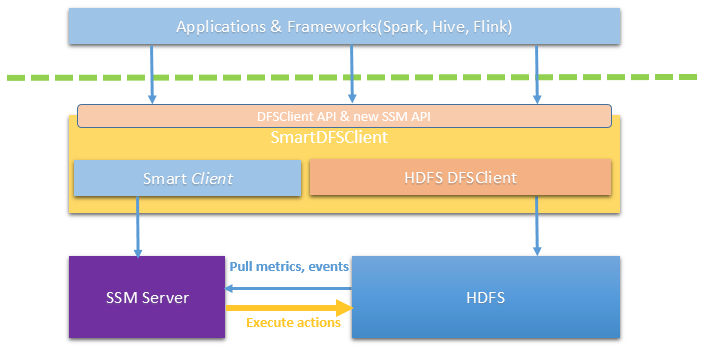

Application API
===============

Application APIs are used by applications run on top of HDFS. This set
of APIs include cache,uncache and enfore storage policy etc. file level operations. System will
execute the file operation on half of application, with the privilege of
the user who starts the application. SSM will provide a SmartDFSClient
which includes both HDFS DFSClient functions and new SSM Application
APIs. Upper level application can use this SmartDFSClient instead of
original HDFS DFSClient. Here is the diagram.

SmartDFSClient API
------------
  
* void **cache**(**String** filePath) **throws** IOException;

  Cache a file

* void **uncache**(**String** filePath) **throws** IOException;

  Uncache a file
* void **enforceStoragePolicy**(**String** filePath, **String** policyName) **throws** IOException;

  Set the storage policy on the file, then enfore the storage policy

SmartClient API
------------

* String\[\] **getSupportedActions**() **throws** IOException;

  List all action names currently supported by the system. Current supported action name are “enforeStoragePolicy”, “cache”, “uncache” etc.

* void **executeAction**(**String** actionName, **String\[\]** actionParams) **throws** IOException;

  A synchronized generic API to execute action. System will maintain an internal task to performance the action. The API will return until the task is finished.
  
* void **executeActionAsync**(**String** actionName, **String\[\]** actionParams) **throws** IOException;

  A asynchronized generic API to execute action. System will maintain an internal task to performance the action. The API will return immediately once the internal task is created.
