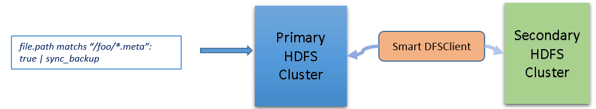
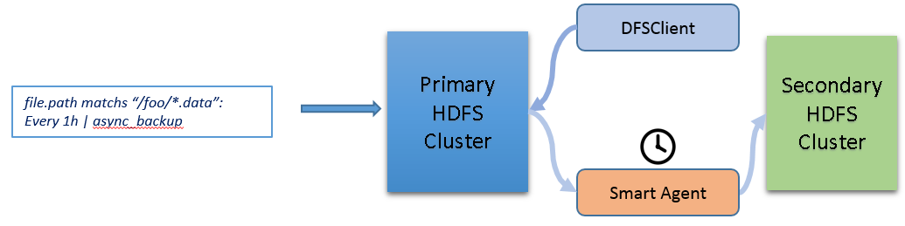
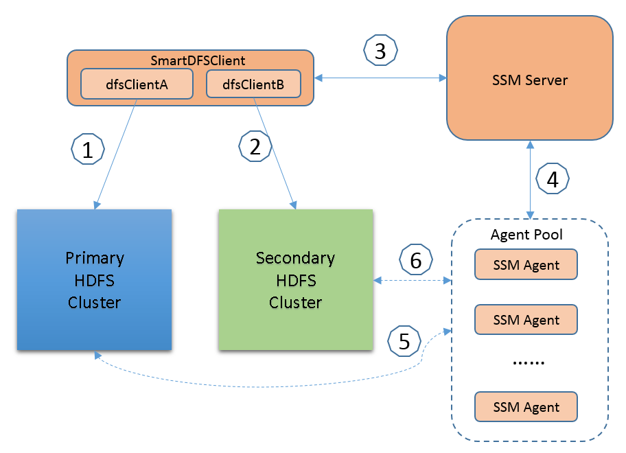

Introduction 
=============

Apache Hadoop is architected to operate efficiently at scale for normal
hardware failures within a datacenter. It is not designed today to
handle datacenter failures. Although HDFS is not designed for deploy
spanning multiple datacenters, replicating data from one location to
another is common practice for disaster recovery and global service
availability.

We’d like to provide a fully distributed, low latency and high
throughput HDFS data replication solution for multiple datacenters
backup.

Limitations of DistCp
=====================

Current available solution for data replication is using distcp. DistCp
provides a robust and reliable backup capability for HDFS data through
batch operation. But at the same time, it has certain disadvantages.

1.  First, it requires administrators’ intervene to specify the backup
    target and when to start the backup process.

2.  Second, it’s not a real-time backup or even not near real-time
    backup solution, for those who require critical data real-time
    backup, DistCp can’t meet their requirements.

3.  Third, DistCp relies on the heavy MapReduce even only a few files
    need to be copied. MapReduce will introduce a lot of execution
    overhead when only one file or a several files involved

Rule Definition
===============

For disaster recovery solution, the ideal is the performance impact to
primary cluster minimization and the replication throughput to Secondary
cluster maximization. But there is a trade-off between the impaction of
primary and the best RPO (Recovery Point Object) of disaster recovery.
We should Administrator the capability to make trade-offs between
latency and data availability through SSM rule.

Administrator can use following pseudo rules.

1.  For critical file & directory, enforce synchronous data writing

	*file.path matches "/fooA/\*.meta": true | sync\_backup*

1.  For none critical file & directory, apply asynchronous data writing

    *file.path matches "/fooA/\*.dat": every 1h | async\_backup*

Use Case – Synchronous Writing
==============================

For critical file & directory, apply the synchronous writing rule to the
files, enforce synchronous data writing. In this case, SmartDFSClient
will replace the existing HDFS Client, be responsible to save the data
to both primary cluster and secondary cluster.

 

Use Case – Asynchronous Replication
===================================

For those none-critical files, apply the asynchronous backup rule to the
files. With the correct rule set, SSM server will regularly scan the
files, schedule Smart Agent to replicate the file at right time. It the
replication is not urgent, SSM server will schedule the replication
action at the time when the workload of primary cluster is relatively
low. Data compression can be also considered before transfer the data
between two clusters to improve the throughput.

Design Targets 
===============

The following list the targets of this design:

1. Support both synchronous writing and asynchronous replication for
data and namespace.

2. Configuring and managing of the disaster recovery feature should be
simple.

3. Decouple all the core disaster recovery functionalities with exiting
HDFS as much as possible, so that the solution can work with many HDFS
versions without redeploy HDFS.

Architecture
============

The basis of this solution is to have one primary Hadoop cluster, one or
more secondary Hadoop clusters. Secondary cluster will be continuously
updated with the data from the primary cluster in either a synchronous
method or an asynchronous method. In this solution, we support both
synchronously writing and asynchronously replication across datacenters
for both namespace and data block. The following architecture diagram
shows the overall architecture of this solution.

The following are the flow of synchronous data writing,

1.  To achieve synchronous data writing, the SmartDFSClient we provided
    will first write data to the primary cluster.

2.  SmartDFSClient then write data to Secondary cluster. To satisfy the
    real synchronous data replication and control the latency,
    SmartDFSClient will return once 1 replica (configurable) is saved in
    Secondary cluster.

If both (1) and (2) are finished, SmartDFSClient then will return as
success. If step (1) fails, then the operation will return with failure.
If step (2) fails, there are two choices for user,

	* Retry the action a few times(configurable), if still fail, rollback
    step (1), operation return with failure

	* Tell Smart Server to start a “replicate data to Secondary cluster”
    asynchronous action, return the operation with success. This is
    Step (3). Once the replication action is recorded, SmartDFSClient
    will return immediately.

4  SSM sever will schedule the replication action to “SSM Agent” which
    is near the Datanode who has the blocks of the source file.

5.  SSM agent pull the data from primary HDFS cluster

6.  SSM agent write the data to secondary HDFS cluster

