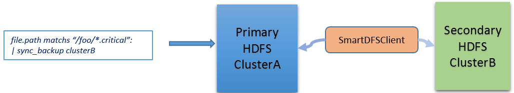
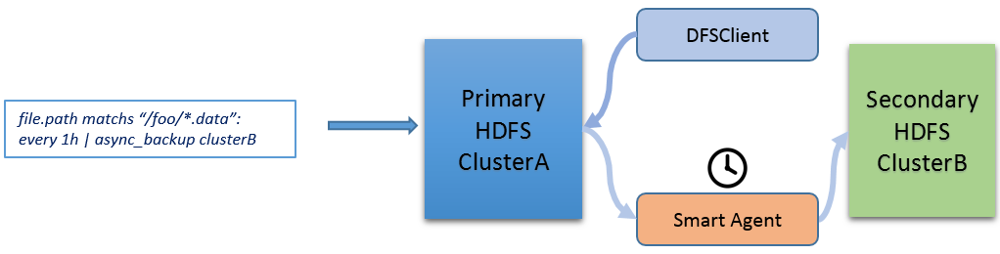
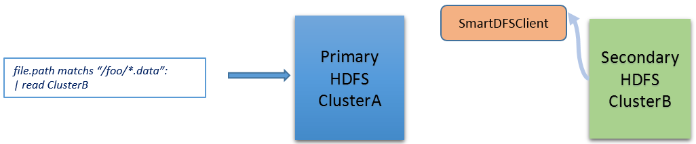
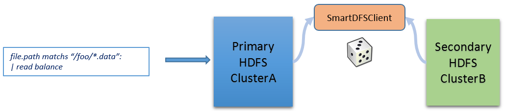
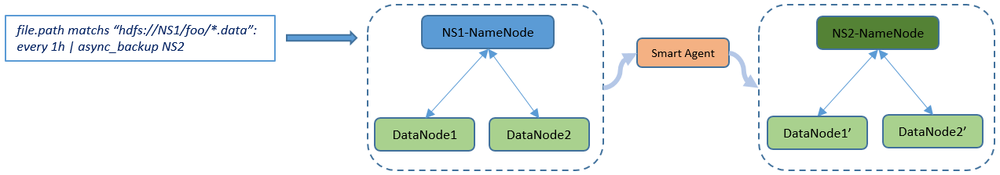
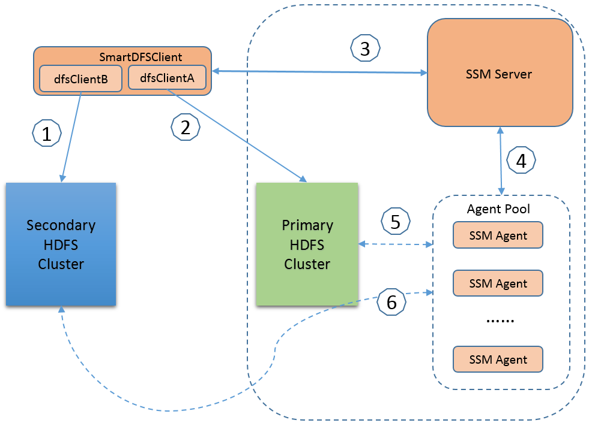

Transparent Cluster Disaster Recovery
=============

Apache Hadoop is architected to operate efficiently at scale for normal hardware failures within a data center. It is not designed today to handle data center failures. Although HDFS is not designed for spanning multiple data centers, replicating data from one location to another is a common practice for disaster recovery and global service availability.

There are lots of ideas contributed to the community in the past about how to solve the notable problem, like in the issue [HDFS-5442](https://issues.apache.org/jira/browse/HDFS-5442). Ideas in HDFS-5442 enlighten us to propose a new solution, which aims to provide a practical, low latency and high throughput solution for syncing up data between clusters to guarantee disaster recovery.

Limitations of DistCp
=====================

Currently, DistCp is an available solution in open source Hadoop for data sync up between clusters. DistCp provides robust and reliable backup capability for syncing up HDFS data through batch operations. But at the same time, it has certain disadvantages.

1. It requires administrators’ intervention to specify the backup target and the time to start the backup process.

2. It is not a real-time backup, even not near real-time backup solution. For those who require critical data real-time backup, DistCp cannot meet their requirements.

3. DistCp relies on heavy MapReduce even only few files need to be copied. Because MapReduce will introduce a lot of execution overhead.

Compared with DistCp, this solution, built on the top of SSM infrastructure, could be smart and incur lower latency in sync up, because of SSM's automatic management mechanism with SSM rule.

Use Cases
==============================

### 1. Synchronous write

For critical file & directory, apply the synchronous writing rule to the files and enforce synchronous data writing. In this case, SmartDFSClient will replace the existing HDFS Client, to save the data to both primary cluster and secondary cluster. With synchronous writing, data is available in both primary cluster and secondary cluster. The drawback is that longer write latency is required.

 
### 2.Asynchronous replication

For those none-critical files, apply the asynchronous backup rule to the files. With the correct rule set, SSM server will regularly scan the files, schedule Smart Agent to replicate the file at right time. If the replication is not urgent, SSM server will schedule the replication action when the workload of primary cluster is relatively low. Data compression can also be considered before transferring the data between two clusters to improve the throughput.

### 3. Transparent read

When high-level application reads data content, by default, data will be read from primary cluster to guarantee that the up-to-date data is returned.
If reading outdated data is acceptable or it is verified that the data in secondary cluster is synced with that in primary cluster,
the read operation can be optimized by getting data from secondary cluster. Here is an example of direct read from backup cluster.

The below picture illustrates that it is acceptable to read from either primary cluster or secondary cluster.

### 4. Replication between federation namespaces

There exists the need to backup files between different namespaces under a HDFS federation cluster, or to migrate files from one namespace to another. With the help of SSM, we can achieve above process efficiently. The fast copy idea in [HDFS-2139](https://issues.apache.org/jira/browse/HDFS-2139) will be referred to during the implementation.

Design Targets 
===============

The targets of this design are listed below:

1. Support both synchronous writing and asynchronous replication for data and namespace.

2. Configuration and management of disaster recovery feature should be simple.

3. Decouple all the core disaster recovery functionalities with existing HDFS as much as possible, so that the solution can work with many HDFS versions without redeploying HDFS.

Architecture
============

The basis of this solution is to have one primary Hadoop cluster and one or more secondary Hadoop clusters. Secondary cluster will be continuously updated with the data from the primary cluster in either a synchronous method or an asynchronous method. In this solution, we support both synchronous writing and asynchronous replication across data centers for both namespace and data block. The following architecture diagram shows the overall architecture of this solution.

The following describes the flow of synchronous data writing.

1.  To achieve synchronous data writing, the SmartDFSClient we provided will first write data to the primary cluster.

2.  SmartDFSClient then write data to Secondary cluster. To achieve the real synchronous data replication and control the latency,
    SmartDFSClient will return once 1 replica (configurable) is saved in Secondary cluster.

If both (1) and (2) are finished, SmartDFSClient then will return as success. If step (1) fails, then the operation will return with failure. If step (2) fails, there are two choices for user,

* Retry the action a few times(configurable), if it still fails, rollback step (1) and the operation will return with failure.
* Tell Smart Server to start a “replicate data to Secondary cluster” asynchronous action, and return the operation with success. This is
  Step (3). Once the replication action is recorded, SmartDFSClient will return immediately.

4.  SSM sever will schedule the replication action to SSM Agent which is generally installed on a Datanode.

5.  SSM agent pull the data from primary HDFS cluster

6.  SSM agent write the data to secondary HDFS cluster

