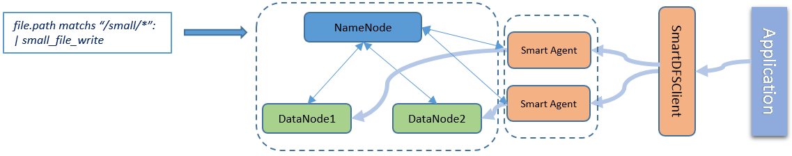
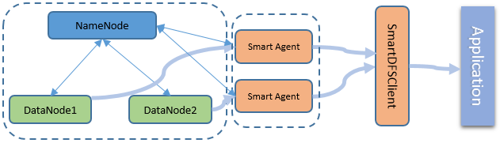
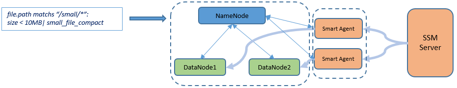
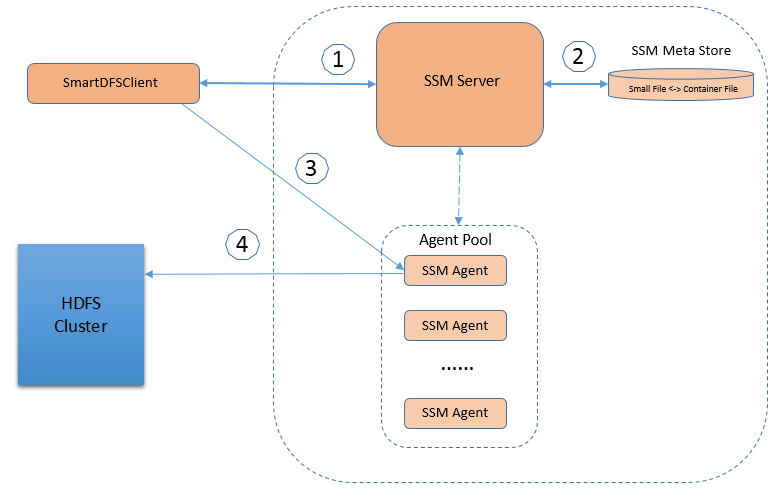
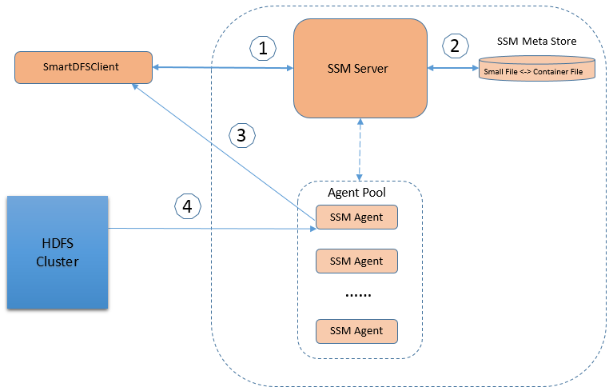

Transparent Small Files Support 
====================

A small file can be defined as a file that is significantly smaller than the Hadoop block size. Apache Hadoop is designed for handling large files. It doesn’t works well with lots of small files. There are two primary impacts for HDFS, one is NameNode memory consumption and namespace explosion, the other is small file write/read performance with the introduced overhead comparing with the small content.

There are several existing solutions to handle this small file problem, such as Hadoop HAR file, sequence file, saving small files into HBase etc. A good read about this is [HDFS small files problem](http://blog.cloudera.com/blog/2009/02/the-small-files-problem/). Additionally, there was an attempt to solve this problem in [HDFS-8998](https://issues.apache.org/jira/browse/HDFS-8998). A large handle related to small files problem on-going in Apache Hadoop community is [OZone effort](https://issues.apache.org/jira/browse/HDFS-7240).

Most existing solutions may solve some of the problems well, but maybe not transparently to applications, or introducing non-trivial modification into HDFS. We’d like to propose a solution to solve these HDFS small files problems in the framework of SSM on top of HDFS based on the ideas from existing approaches and discussions with industry experts. 

In this solution, we introduce a concept of container file. A container file is a normal big HDFS file with configurable threshold size, say 1G. A container file can contains hundreds or thousands of small files. The mapping between small files and container file are maintained by SSM metastore. As the format of container file, we may consider existing Hadoop file format. SSM metastore holds the mapping information between small files and container file. The mapping maintains small file id, container file id and index info.

Design Targets 
===============

The following list the targets of this design:

1. Better read performance than current HDFS small file read in average.

2. At least equivalent if no better small file write performance than current HDFS small file write.

3. Optimize NameNode memory usage and compact namespace.

4. Transparent small file read/write for applications.

Use Cases
=========

We want to optimize and solve the small files problem in 3 cases, not only for read, but also for write. For existing small files in an HDFS cluster, we also support compaction.

### 1. Write new small file

In SSM infrastructure, all user preferences are represented by rules. For foreseeable small files, apply the small file write rule to the files. In this case, SmartDFSClient will replace the existing HDFS Client, be responsible to save the data to HDFS. SmartDFSClient will not directly create small file in NameNode. Instead, it will query SSM server for which container file (a normal HDFS file used for small files bucket) will the small file be saved to, then SmartDFSClient will talk to SSM agent who is responsible to save the small file content into the container file.

### 2. Read small file

To read a small file, SSM server has the knowledge about which container file the small file is stored into, when read the small data, SmartDFSClient will first query SSM server to find the corresponding container file, offset into the container file and length of the small file, then passes all these information to the Smart Agent to read the data content from the DataNode.

### 3. Compact existing small files

There can be many small files written into HDFS already in an existing deployment and users may want to compact all these small files. To achieve this goal, apply the small file compact rule to the files. With the rule set, SSM server will scan the files and directories, schedule tasks to compact small files into big container file, and then truncate the original small files. 

Architecture
============

The following diagram shows the small file write flow.

Here is the writing flow,

1.  SmartDFSClient first communicate with SSM server once it wants to
    create a new file. SSM server will check if the file goes to
    directory which has small-file-write rule applied. If it is a small
    file, SSM server will do privilege check to guarantee that
    SmartDFSClient has the privilege to write data into the directory.
    If the privilege check fails, SSM server will return error
    to SmartDFSClient.

2.  After the privilege check is passed. SSM server queries
    metadata store about which container file is suitable to hold the
    new small file, and from which offset of the container file to start put
    the new content, also which SSM Agent will be the proxy to chain the
    data writing action. SSM server then packages all these information
    into a token, and return the token to SmartDFSClient.

3.  SmartDFSClient passes the token received from SSM server,
    together with the file content to the corresponding SSM Agent.

4.  SSM Agent is responsible to write the content of small file into the container
    file effectively.

If user happens to write a big file through the small file write process, SSM can handle this case without obvious performance degrade.

The small file read flow path is very similar to write flow path, except the data content flow direction is different.

Other HDFS operations support
=============================

### 1. Supported operations

In addition to write and read, we also provide many HDFS compatible operations. Some of the operations don't need get any information from SSM server, some need get file container info from meta store first, some require special handling.

i. Now that the original small files are truncated after compact, the meta data are still preserved in the namespace. Below are the operations which simply need to get information from namespace.

* Get and set extended attributes: getXAttr, getXAttrs, listXAttrs, setXAttr, removeXAttr.
* Get and check acl info: getAclStatus, checkAccess.
* Get and set some other meta data: getBlockSize, exists, listPaths, setTimes.

ii. Due to the file container info (corresponding container file, offset and length) of small files are stored in SSM meta store, some operations need first query SSM server to get the file container info, then use these information to send exact requests to HDFS server.

* Get block info: getLocatedBlocks, getBlockLocations, getFileBlockLocations.
* Get checkSum: getFileChecksum.
* Get file info: getFileInfo, listStatus, listStatusIterator, getFileStatus, isFileClosed.

iii. Operations like the following impact small file's meta in namespace as well as meta store of SSM.

* Rename small file: rename small file in both namespace and meta store.

* Delete small file: delete small file in hdfs, then delete the file container info of small file in meta store.

* Truncate small file: since the small file is already truncated in hdfs, so only need to set the length of small file to zero in meta store.

> Note that the content of small file is still stored in the container file after delete or truncate.

### 2. Unsupported operations

There are a number of operations, such as setAcl, which are not supported now, we can consider such later in future.

i. Operations below can be executed successfully, but the results are not accurate.

* Get and set storage policy: getStoragePolicies, setStoragePolicy.
* Get and set cache: addCacheDirective, removeCacheDirective, listCacheDirectives, modifyCacheDirective.
* Others: setReplication, getContentSummary.

ii. The following operations are not allowed to execute.

* Set acl: setPermission, setOwner, modifyAclEntries, removeAclEntries, setAcl, removeDefaultAcl.
* Symlink: createSymlink, getFileLinkStatus, getLinkTarget, getFileLinkInfo.
* Others: concat, listCorruptFileBlocks.

Performance Consideration
=========================

The read performance penalty is mainly caused by random diskIO when access many small size files. To improve the small file read
performance, Smart Agent may leverage HDFS cache mechanism to cache the whole container block once a small file content in the block is read. Most likely, the adjacent small files will be read soon by upper application, so cache ahead or read ahead may improve the read performance a lot. Generally container files will be regarded as **HOT** so policy like ALL-SSD can be used to speed up the read.

A special case is small files batch read. In such case new APIs will be provided by SmartDFSClient allowing applications to list small files buckets/containers and read batch of small files in a container/bucket at a time. Some new Hadoop format based on this can also be considered. This case is particularly useful in deep learning training, because many small image files are fed to a training worker as a batch at a time. 

Security Consideration 
=======================

For now container file includes the small files which have the same acl under a folder, and the container file is saved in the same directory of small files. In this way we can ensure container file has the same acl of small files.

When reading small file, SSM server will check whether the user has the necessary permission to the small file, after privilege check passed, SSM server will use the file container info queried from meta store to read small file from the container file.

