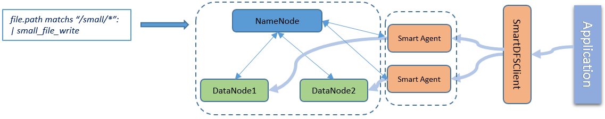
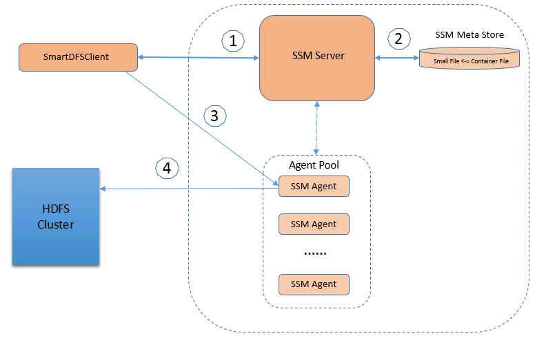

HDFS Small Files Solution 
====================

A small file can be defined as a file that is significantly smaller than
the Hadoop block size. Apache Hadoop is designed for handle large files.
It doesn’t works well with lot of small files. There are two primary
impacts if Hadoop has a small file problem, one is NameNode memory
management and another is MapReduce performance.

There are several existing solutions to handle this small file problem,
such as Hadoop HAR file, sequence fie, save small files into HBase etc.
Most existing solution can resolve NameNode memory management problem
well, but not the MapReduce performance problem. We’d like to like to
propose a fully solution to solve the both NameNode memory issue and
MapReduce performance issue based on the inspirations from all existing
approaches.

Design Targets 
===============

The following list the targets of this design:

1. Transparent small file read/write from application

2. At least equivalent if no better small file write performance than
current HDFS small file writing

3. Better read performance than current HDFS small file reading

Use Cases
=========

Generally, people are complaining about performance penalty of reading
small files, they are not complaining write small files. Some existing
approach is that there will a routine which compacts all these small
files at some point. We’d like to design our solution from a different
angel. The point is, we want to eliminate the small files at the point
of its writing.

Write small file
----------------

In SSM infrastructure, all user prefers are represented by rules. For
foreseeable small files, apply the small file write rule to the files.
In this case, SmartDFSClient will replace the existing HDFS Client, be
responsible to save the data to HDFS. SmartDFSClient will not direct
create small file in NameNode. Instead, it will query SSM server for
which container file will the small file be saved to, then
SmartDFSClient will talk to SSM agent which is responsible to save the
small file content into the container file.

Read small file
--------------------------

To read small files, apply the small file read rule to the files. With
the correct rule set, SmartDFSClient will first query SSM server to find
the container file, offset into the container file and length of the
small file, passes all these information to the Smart agent to read the
content from the DataNode.

Performance Consideration
=========================

In this solution, first we will introduce the container file. A
container file is a configurable fixed size HDFS big file, say 1G. A
container file will contains hundreds or thousands small files. By using
container file, considerable NameNode memory will be saved.

The mapping relationship between small file and container file will be
maintained in SSM server. We will also consider some custom file format
of container file so that the mapping information can be self-described
in container file.

The MapReduce performance penalty is mainly caused by random diskIO when
access many small size files. To improve the small file read
performance, Smart Agent will introduce cache mechanism to cache the
whole container block once a piece of content of one small file is read.
Most likely, the near small files will be read soon by upper
application, so cache ahead will improve the read performance a lot.

By using SmartDFSClient, which provides compatible API definition as
existing HDFS DFSClient, small file read and write will be transparent
to upper level application.

Security Consideration 
=======================

When access small files, SSM server should check whether SmartDFSClient
has the authorization to write to the directory or read the file. For
prevent SmartDFSClient from reading contents which it has no privilege,
all container files will be owned by a special user created for SSM
Agent. Only SSM Agent can read and write container files.

Architecture
============

The following architecture diagram shows the small file write flow and
read flow.

The following are the flow of file writing,

1.  SmartDFSClient will communicate with SSM server once it wants to
    create a new file. SSM server will check if the file goes to
    directory which has small-file-write rule applied. If it is a small
    file, SSM server will do privilege check to guarantee that
    SmartDFSClient has the privilege to write data into the directory.
    If the privilege check fails, SSM server will return error
    to SmartDFSClient.

2.  After the privilege check is passed. SSM server will query its
    metadata store about which container file is suitable to hold the
    new small file, and from which offset of the container file to put
    the new content, also which SSM Agent will be the proxy to chain the
    data writing action. SSM server will package all these information
    into a token, and return it to SmartDFSClient.

3.  SmartDFSClient will pass the token received from SSM server,
    together with the file content, send to the corresponding SSM Agent.

4.  By through SSM Agent, small file is written into the container
    file effectively.

The small file read path is very similar to write path, except the data
content flow direction.

